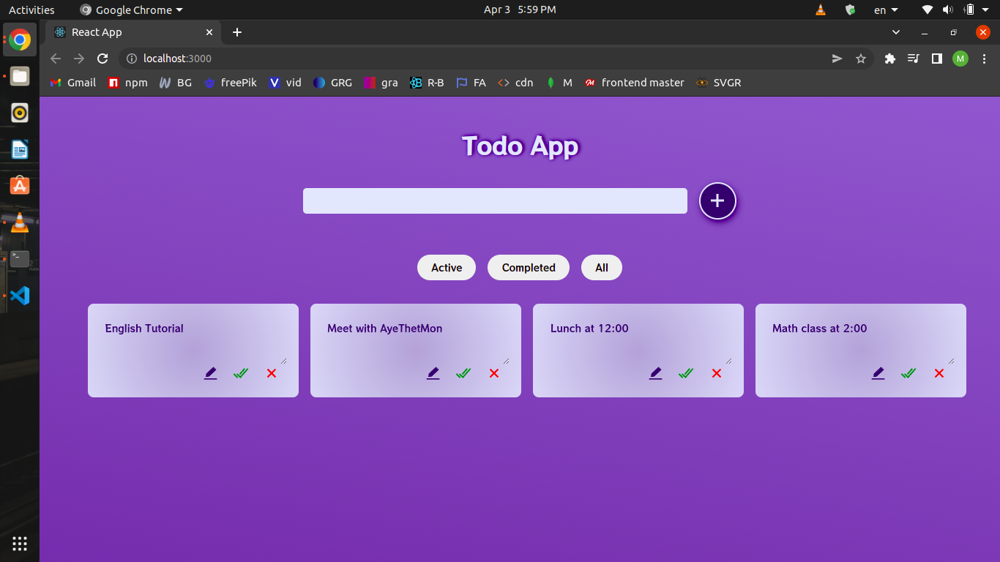
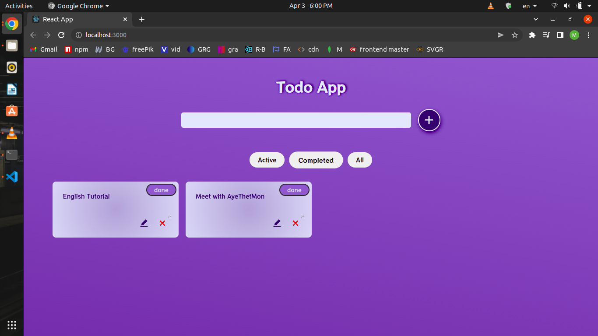

### `git clone ....`

### `npm install`

### `npm start`

# Here is how my project looks like

https://user-images.githubusercontent.com/54218260/161427687-e61e4db6-a037-4b27-b59b-b5945c053234.mp4

